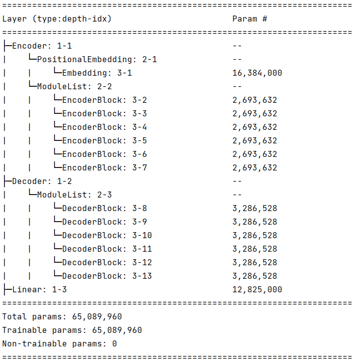

transformer base model with more than 65x10^6 params

hyper params
- num_layers = 6
- d_model = 512
- fc_hidden = 2048
- num_heads = 8
- drop_rate = 0.1(haven't implement yet)
- input_vocab_size = 32000  
- output_vocab_size = 25000  
- kdim = 64
- vdim = 64

